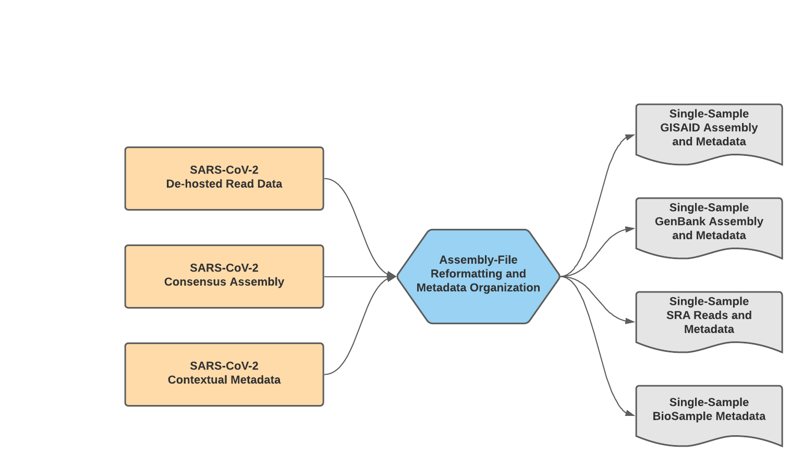
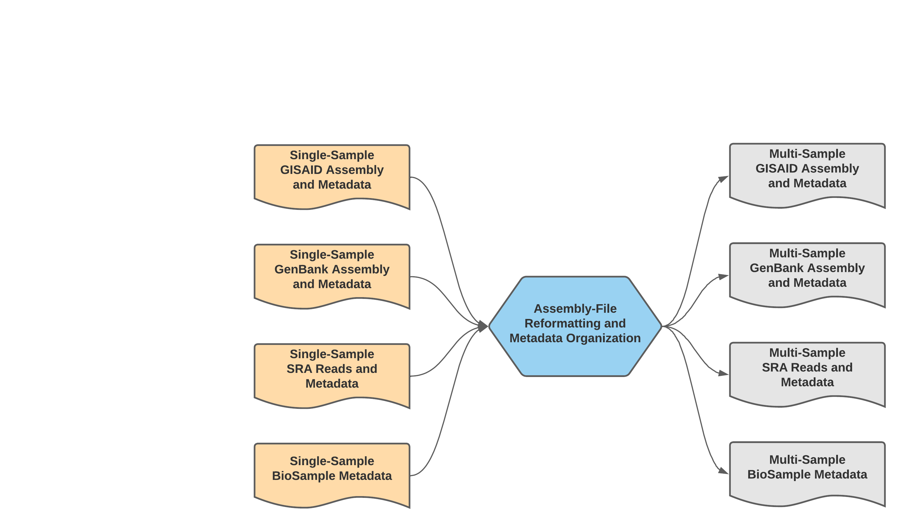

==================================
TheiaCoV Mercury Workflow Series
==================================

The Mercury workflow series was developed to allow users to efficiently and accurately prepare submission files for GISAID, SRA, and Genbank submissions as well as BioSample registration. As of today (November 11th, 2021) these workflows are specific to SARS-CoV-2 amplicon read data from clinical samples, but work is underway to allow for the submission preparation of other viral pathogens of concern. 

These workflows were written to ingest and properly format all suggested metadata fields as per the Public Health Alliance for Genomic Epidemiology's SARS-CoV-2 Contextual Data Specifications_.

.. _Specifications: https://github.com/pha4ge/SARS-CoV-2-Contextual-Data-Specification

Mercury Workflows for Single-Sample Preparation
-----------------------------------------------

Sharing of sample read and assembly data through internationally accessible databases allows insights to be drawn about how the virus is spreading and mutating across the globe; the more freely available these data are to international researchers and public health scientists, the stronger our decision making can be.

The Mercury workflows for single-sample preparation is made up of two separate WDL workflows, Mercury_SE_Prep & Mercury_PE_Prep, for preparing submission files to GISAID, SRA, and GenBank for single and paired-end read data, respectively. These two workflows will process read data, assembly files, and contextual metadata to prepare submission for samples individually--while these workflows can process multiple samples in a single run, the submission files prepared are for single-sample submission; for preparation of multiple samples (i.e. batch submission), please see details for the Mercury_Batch workflow below. 

   **Mercury_Prep Data Workflow**

A series of introductory training videos that provide conceptual overviews of methodologies and walkthrough tutorials on how to utilize these Mercury workflows through Terra are available on the Theiagen Genomics YouTube page:

.. raw:: html

  <iframe width="560" height="315" src="https://www.youtube.com/embed/h8YASVckOrw" title="YouTube video player" frameborder="0" allow="accelerometer; autoplay; clipboard-write; encrypted-media; gyroscope; picture-in-picture" allowfullscreen></iframe>
  

|

Mercury_PE_Prep
===============
The Mercury_PE_Prep workflow was written to process paired-end read data, assembly files, and contextual metadata to prepare submission for samples individually. 

.. note::
  With default settings, this workflow will only prepare submission files for samples with assembly files containing less than 5,000 Ns. This quality threshold can be adjusted by modifying the number_N_threshold. 

A step-by-step video tutorial for utilizing the Mercury_PE_Prep workflow has been made available on the Theiagen YouTube Page:

.. raw:: html

  <iframe width="560" height="315" src="https://www.youtube.com/embed/h8YASVckOrw" title="YouTube video player" frameborder="0" allow="accelerometer; autoplay; clipboard-write; encrypted-media; gyroscope; picture-in-picture" allowfullscreen></iframe>
  

|

More information on required user inputs, optional user inputs, default tool parameters and the outputs generated by Mercury_PE_Prep are outlined below.

Required User Inputs
********************
Download CSV: :download:`Mercury_PE_Prep_required_inputs.csv <tables/mercury_workflows/mercury_pe_prep_required_inputs.csv>`

.. csv-table::
  :file: tables/mercury_workflows/mercury_pe_prep_required_inputs.csv
  :widths: 20, 20, 20, 40
  :header-rows: 1

|

Optional User Inputs
********************

Download CSV: :download:`Mercury_PE_Prep_optional_inputs.csv <tables/mercury_workflows/mercury_pe_prep_optional_inputs.csv>`

.. csv-table::
 :file: tables/mercury_workflows/mercury_pe_prep_optional_inputs.csv
 :widths: 10, 10, 10, 10, 20
 :header-rows: 1

|

Outputs
********************
Download CSV: :download:`Mercury_PE_Prep_default_outputs.csv <tables/mercury_workflows/mercury_pe_prep_outputs.csv>`

.. csv-table::
  :file: tables/mercury_workflows/mercury_pe_prep_outputs.csv
  :widths: 20, 20, 60
  :header-rows: 1

|

Mercury_SE_Prep
================
The Mercury_SE_Prep workflow was written to process single-end read data, assembly files, and contextual metadata to prepare submission for samples individually. 

.. note::
 With default settings, this workflow will only prepare submission files for samples with assembly files containing less than 5,000 Ns. This quality threshold can be adjusted by modifying the number_N_threshold. 

More information on required user inputs, optional user inputs, default tool parameters and the outputs generated by Mercury_SE_Prep are outlined below.

Required User Inputs
********************
Download CSV: :download:`Mercury_SE_Prep_required_inputs.csv <tables/mercury_workflows/mercury_se_prep_required_inputs.csv>`

.. csv-table::
  :file: tables/mercury_workflows/mercury_se_prep_required_inputs.csv
  :widths: 20, 20, 20, 40
  :header-rows: 1

|

Optional User Inputs
********************

Download CSV: :download:`Mercury_SE_Prep_optional_inputs.csv <tables/mercury_workflows/mercury_se_prep_optional_inputs.csv>`

.. csv-table::
 :file: tables/mercury_workflows/mercury_se_prep_optional_inputs.csv
 :widths: 10, 10, 10, 10, 20
 :header-rows: 1

|

Outputs
********************
Download CSV: :download:`Mercury_SE_Prep_default_outputs.csv <tables/mercury_workflows/mercury_se_prep_outputs.csv>`

.. csv-table::
  :file: tables/mercury_workflows/mercury_se_prep_outputs.csv
  :widths: 20, 20, 60
  :header-rows: 1

|

Mercury Workflows for Multiple-Sample (Batch) Preparation
---------------------------------------------------------

We have made a single WDL workflow for multiple-sample (batch) preparation: Mercury_Batch. 

 **Mercury_Batch Data Workflow**

Mercury_Batch
===============
The Mercury_Batch workflow was written to process the output submission files from Mercury_PE_Prep or Mercury_SE_Prep and combine them to enable GISAID, SRA, and Genbank batch submission as well as batch BioSample registration. To avoid issues with NCBI GenBank rejections, the Mercury_Batch workflow will remove any sample with raised VADR_ alerts from the prepared batch submission files. 

.. _VADR: https://github.com/ncbi/vadr

.. note::
  With default settings, this workflow will remove samples any sample with one or more raised VADR alerts. This screening threshold can be adjusted by modifying the vadr_threshold. 

A step-by-step video tutorial for utilizing the Mercury_Batch workflow has been made available on the Theiagen YouTube Page:

.. raw:: html

  <iframe width="560" height="315" src="https://www.youtube.com/embed/h8YASVckOrw" title="YouTube video player" frameborder="0" allow="accelerometer; autoplay; clipboard-write; encrypted-media; gyroscope; picture-in-picture" allowfullscreen></iframe>

|

More information on required user inputs, optional user inputs, default tool parameters and the outputs generated by Mercury_Batch are outlined below.

Required User Inputs
********************
Download CSV: :download:`Mercury_Batch_required_inputs.csv <tables/mercury_workflows/mercury_batch_required_inputs.csv>`

.. csv-table::
   :file: tables/mercury_workflows/mercury_batch_required_inputs.csv
   :widths: 20, 20, 20, 40
   :header-rows: 1

|

Optional User Inputs
********************

Download CSV: :download:`Mercury_Batch_optional_inputs.csv <tables/mercury_workflows/mercury_batch_optional_inputs.csv>`

.. csv-table::
  :file: tables/mercury_workflows/mercury_batch_optional_inputs.csv
  :widths: 10, 10, 10, 10, 20
  :header-rows: 1

|

Outputs
********************
Download CSV: :download:`Mercury_Batch_default_outputs.csv <tables/mercury_workflows/mercury_batch_outputs.csv>`

.. csv-table::
   :file: tables/mercury_workflows/mercury_batch_outputs.csv
   :widths: 20, 20, 60
   :header-rows: 1

|

