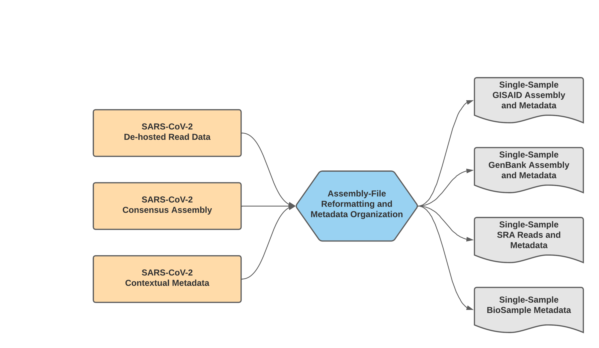

==================================
Mercury Workflow Series
==================================
Sharing of sample read and assembly data through internationally accessible databases allows insights to be drawn about how the virus is spreading and mutating across the globe. This allows international researchers and public health scientists to use these data and help all of us make stronger public health decisions.

The Mercury workflow series was developed to allow users to efficiently and accurately prepare submission files for GISAID, SRA, and Genbank submissions as well as BioSample registration. As of November 11th, 2021, these workflows are specific to SARS-CoV-2 amplicon read data from clinical samples. Workflows are available for single-sample preparations from Illumina single-end and paired-end datatypes, and for batched data submission.

These workflows were written to properly format all suggested metadata fields as per the `Public Health Alliance for Genomic Epidemiology (PH4GE)'s SARS-CoV-2 Contextual Data Specifications <https://github.com/pha4ge/SARS-CoV-2-Contextual-Data-Specification>`-

A series of introductory training videos provide a conceptual overview of the methods and walkthrough tutorials on how to use these Mercury workflows through Terra are available on the Theiagen Genomics YouTube page:

.. raw:: html

  <iframe width="560" height="315" src="https://www.youtube.com/embed/h8YASVckOrw" title="YouTube video player" frameborder="0" allow="accelerometer; autoplay; clipboard-write; encrypted-media; gyroscope; picture-in-picture" allowfullscreen></iframe>

|

Mercury Workflows for Single-Sample Preparation
-----------------------------------------------

The Mercury Workflows for Single-Sample Preparation process read data, assembly files, and contextual metadata to prepare submission for samples individually. There are two separate WDL workflows, Mercury_SE_Prep & Mercury_PE_Prep, which prepare submission files for GISAID, SRA, and GenBank from single and paired-end read data, respectively. 

.. note::
 With default settings, this workflow will only prepare submission files for samples with assembly files containing less than 5,000 Ns. This quality threshold can be adjusted by modifying the number_N_threshold. 

 Additonally, while these workflows can process multiple samples in a single run, the prepared submission files are for single-sample submission. For preparation of multiple samples (i.e. batch submission), please see details for the Mercury_Batch_ workflow below. 

|

Mercury_PE_Prep
=================
The Mercury_PE_Prep workflow was written to process paired-end read data, assembly files, and contextual metadata to prepare submission for samples individually. 

A step-by-step video tutorial for utilizing the Mercury_PE_Prep workflow has been made available on the Theiagen YouTube Page:

.. raw:: html

  <iframe width="560" height="315" src="https://www.youtube.com/embed/h8YASVckOrw" title="YouTube video player" frameborder="0" allow="accelerometer; autoplay; clipboard-write; encrypted-media; gyroscope; picture-in-picture" allowfullscreen></iframe>

|

More information on `required user inputs <https://github.com/theiagen/public_health_viral_genomics/blob/main/docs/source/tables/mercury_workflows/mercury_pe_prep_required_inputs.csv>`_, `optional user inputs <https://github.com/theiagen/public_health_viral_genomics/blob/main/docs/source/tables/mercury_workflows/mercury_pe_prep_optional_inputs.csv>`_, and the `outputs <https://github.com/theiagen/public_health_viral_genomics/blob/main/docs/source/tables/mercury_workflows/mercury_pe_prep_outputs.csv>`_ generated by Mercury_PE_Prep are outlinedin the links.

Mercury_SE_Prep
================
The Mercury_SE_Prep workflow was written to process single-end read data, assembly files, and contextual metadata to prepare submission for samples individually. 

More information on `required user inputs <https://github.com/theiagen/public_health_viral_genomics/blob/main/docs/source/tables/mercury_workflows/mercury__se_prep_required_inputs.csv>`_, `optional user inputs <https://github.com/theiagen/public_health_viral_genomics/blob/main/docs/source/tables/mercury_workflows/mercury_se_prep_optional_inputs.csv>`_, and the `outputs <https://github.com/theiagen/public_health_viral_genomics/blob/main/docs/source/tables/mercury_workflows/mercury_se_prep_outputs.csv>`_ generated by Mercury_PE_Prep are outlinedin the links.

Mercury Workflows for Multiple-Sample (Batch) Preparation
---------------------------------------------------------

We have made a single WDL workflow, Mercury_Batch, for multiple-sample (batch) preparation of data for submission to achriving databases. 

Mercury_Batch
===============
The Mercury_Batch workflow was written to process the output submission files from Mercury_PE_Prep or Mercury_SE_Prep and combine them to enable GISAID, SRA, and Genbank batch submission as well as batch BioSample registration. To avoid issues with NCBI GenBank rejections, the Mercury_Batch workflow will remove any sample with raised `VADR <https://github.com/ncbi/vadr>`_ alerts from the prepared batch submission files. This screening threshold can be adjusted by modifying the vadr_threshold. 

A step-by-step video tutorial for utilizing the Mercury_Batch workflow has been made available on the Theiagen YouTube Page:

.. raw:: html

  <iframe width="560" height="315" src="https://www.youtube.com/embed/h8YASVckOrw" title="YouTube video player" frameborder="0" allow="accelerometer; autoplay; clipboard-write; encrypted-media; gyroscope; picture-in-picture" allowfullscreen></iframe>

|

More information on `required user inputs <https://github.com/theiagen/public_health_viral_genomics/blob/main/docs/source/tables/mercury_workflows/mercury_batch_required_inputs.csv>`_, `optional user inputs <https://github.com/theiagen/public_health_viral_genomics/blob/main/docs/source/tables/mercury_workflows/mercury_batch_optional_inputs.csv>`_, and the `outputs <https://github.com/theiagen/public_health_viral_genomics/blob/main/docs/source/tables/mercury_workflows/mercury_batch_outputs.csv>`_ generated by Mercury_PE_Prep are outlinedin the links.
