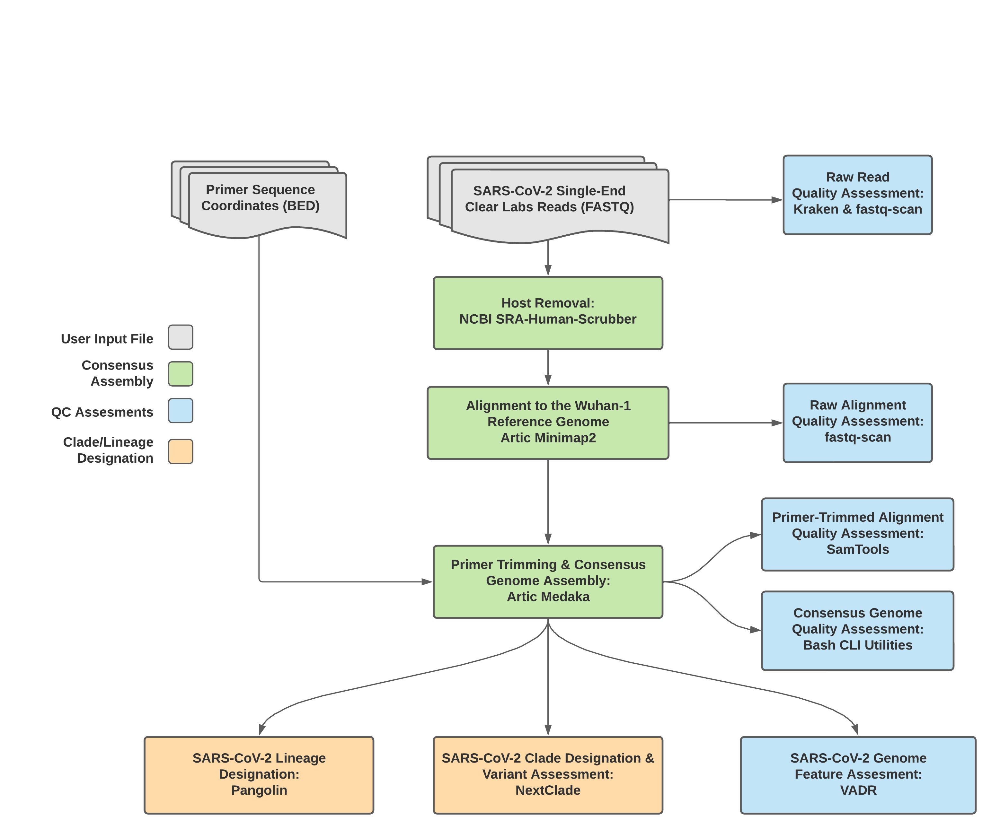

===================================
TheiaCoV Characterization Series
===================================

The TheiaCoV Characterization Series is a collection of WDL workflows for performing genomic assembly, quality assessment and characterization of SARS-CoV-2 data to support public health decision-making. These include workflows for analysis of newly generated data and workflows to update the Pangolin and VADR outputs for previously analyzed data. Further workflows are available for subsequent genomic epidemiology of SARS-CoV-2.

Overview 
===========

Genomic characterization of pathogens is an increasing priority for public health laboratories globally. The workflows in the TheiaCoV Genomic Characterization Series make this easy for SARS-CoV-2 by either taking in raw next-generation sequencing (NGS) data or FASTA assembly files to characterize the virus to the most up-to-date international standards. The workflows facilitate (as required):

1. **Assembly:** Mapping input read data to a reference genome, removing primer reads from that alignment, and then calling the consensus assembly based on the primer-trimmed alignment
2. **Quality assessment (QA):** Producing relevant quality-control (QA) metrics for the input read data and the generated assembly. 
3. **Characterization:** Using Pangolin for lineage assignment, NextClade for clade assignment, and VADR for validation and annotation. 

There are five workflows in the TheiaCoV Characterization Series. They vary according to their input sequencing datatypes, supporting the following: 

* Illumina paired-end data (TheiaCoV_Illumina_PE_ workflow)
* Illumina single-end data (TheiaCoV_Illumina_SE_ workflow)
* Clear Labs data (TheiaCoV_ClearLabs_ workflow)
* Oxford Nanopore Technology data (TheiaCoV_ONT_ workflow)
* Previously assembled genomes in FASTA format (TheiaCoV_FASTA_ workflow)- this produces only assembly QA metrics, Pangolin lineage and clade assignments.

The input datatypes affect how the downstream assembly and QA steps have to be performed. Methological details for these steps are described for each workflow below. Ultimately, all workflows create equivalent assemblies that are then characterized in the same way. 

More details on how to get started with running these workflows are provided in the `Overview <https://public-health-viral-genomics-theiagen.readthedocs.io/en/latest/overview.html#>`_ page.

.. note:: 
    **For all workflows:**

    **Input:** All TheiaCoV workflows take in sequencing data generated using tiled PCR-amplicons designed for the SARS-CoV-2 genome. Most commonly, these are generated with the `Artic V3 protocol <https://github.com/artic-network/artic-ncov2019/tree/master/primer_schemes/nCoV-2019/V3>`_ but reads resulting from alternative primer/PCR schemes such as the `QIAseq Primer Panel <https://www.qiagen.com/us/products/next-generation-sequencing/rna-sequencing/qiaseq-sars-cov-2-primer-panel/>`_, the `Artic V4 Amplicon Sequencing Panel <https://github.com/artic-network/artic-ncov2019/tree/master/primer_schemes/nCoV-2019/V4>`_, the `Artic V4.1 Amplicon Sequencing Primer Panel <https://github.com/artic-network/artic-ncov2019/tree/master/primer_schemes/nCoV-2019/V4.1>`_, and the `Midnight Amplicon Primer Set <https://www.protocols.io/view/sars-cov2-genome-sequencing-protocol-1200bp-amplic-rm7vz8q64vx1/v6>`_ can also be analysed with this workflow. The primer sequence coordinates of the PCR scheme used must be provided in `BED file format <https://en.wikipedia.org/wiki/BED_(file_format)#>`_ along with the raw paired-end Illumina read data in FASTQ format. If you are running your workflow on Terra, the bed files for these most commonly used PCR primers can be found in the Data tab, in the workspace data group.

    **QA:** All data should be assessed relative to quality control guidelines for SARS-CoV-2 (e.g. `QC guidelines produced by PH4GE <https://github.com/pha4ge/pipeline-resources/blob/udubs-qc-guidance-dev/docs/qc-solutions.md#gisaid-assembly-acceptance-criteria>`_). 

    **Characterization:** All workflows in this series characterize genomes using `Pangolin <https://cov-lineages.org/>`_ for lineage assignment, `NextClade <https://docs.nextstrain.org/projects/nextclade/en/stable/index.html>`_ for clade assignment, and `VADR <https://github.com/ncbi/vadr>`_ for validation and annotation. These tools and their underlying databases are updated regularly and have many versions available, one of which should be selected when running the workflow. The latest versions are described `here <https://www.notion.so/theiagen/Docker-Image-and-Reference-Materials-for-SARS-CoV-2-Genomic-Characterization-98328c61f5cb4f77975f512b55d09108>`.

TheiaCoV_Illumina_PE 
================================

.. figure:: images/TheiaCoV_Illumina_PE.png
   :width: 800
   :alt: TheiaCoV_Illumina_PE workflow
   :figclass: align-center

**Input:** The `TheiaCoV_Illumina_PE workflow <https://github.com/theiagen/public_health_viral_genomics/blob/main/workflows/wf_theiacov_illumina_pe.wdl>`_ was written to process Illumina paired-end (PE) read data generated by tiled PCR for genomic characterization of SARS-CoV-2. By default, this workflow will assume that input reads were generated using a 300-cycle sequencing kit (i.e. 2 x 150 bp reads). Modifications to the optional parameter for trimmomatic_minlen may be required to accommodate shorter read data, such as 2 x 75bp reads generated using a 150-cycle sequencing kit.

**Assembly:** As outlined in the schematic above, consensus genome assembly with the TheiaCoV_Illumina_PE workflow is performed by first removing human read data with the `NCBI SRA-Human-Scrubber <https://github.com/ncbi/sra-human-scrubber>`_ tool then trimming low-quality reads with `Trimmomatic <http://www.usadellab.org/cms/?page=trimmomatic>`_ and removing adapter sequences with `BBDuk <https://jgi.doe.gov/data-and-tools/software-tools/bbtools/bb-tools-user-guide/bbduk-guide/>`_. These cleaned read data are then aligned to the `Wuhan-1 reference genome <https://github.com/artic-network/artic-ncov2019/blob/master/primer_schemes/nCoV-2019/V3/nCoV-2019.reference.fasta>`_ (unless optionally specified otherwise) with `BWA <http://bio-bwa.sourceforge.net/>`_ to generate a Binary Alignment Mapping (`BAM <https://en.wikipedia.org/wiki/Binary_Alignment_Map>`_) file. Primer sequences are next removed from the BAM file using the `iVar Trim <https://andersen-lab.github.io/ivar/html/manualpage.html>`_ sub-command. The iVar Consensus sub-command is then used to generate a consensus assembly in FASTA format.

**QA:** The output files from this workflow are all subjected to quality assessment: 

* Read data is assessed with `Kraken2 <https://ccb.jhu.edu/software/kraken2/>`_ to identify the species represented by the reads and with `fastq-scan <https://github.com/rpetit3/fastq-scan>`_, before and after read cleaning, to determine read technical quality. 
* Quality metrics about the genome alignment are generated with `Samtools <http://www.htslib.org/>`_
* Bash CLI utilities generate quality metrics about the consensus genome assembly. 
* NCBI’S `VADR <https://github.com/ncbi/vadr>`_ tool screens for potentially errant features in the assembly (e.g. erroneous frame-shift mutations).

More information about the TheiaCoV_Illumina_PE workflow including inputs, outputs and default tool parameters can be found in the tables of `required user inputs <https://github.com/theiagen/public_health_viral_genomics/blob/main/docs/source/tables/theiacov_workflows/theiacov_illumina_pe_required_inputs.csv>`_, `optional user inputs <https://github.com/theiagen/public_health_viral_genomics/blob/main/docs/source/tables/theiacov_workflows/theiacov_illumina_pe_optional_inputs.csv>`_ and `outputs <https://github.com/theiagen/public_health_viral_genomics/blob/main/docs/source/tables/theiacov_workflows/theiacov_illumina_pe_outputs.csv>`_.

.. toggle-header::
    :header: **References**

        When publishing work using TheiaCoV_Illumina_PE, please reference the following:
      
        **NCBI SRA-Human-Scrubber** Based on Katz KS, Shutov O, Lapoint R, Kimelman M, Brister JR, O’Sullivan C. STAT: a fast, scalable, MinHash-based k-mer tool to assess Sequence Read Archive next-generation sequence submissions. Genome biology. 2021 Dec;22(1):1-5.

        **trimmomatic** Bolger AM, Lohse M, Usadel B. Trimmomatic: a flexible trimmer for Illumina sequence data. Bioinformatics. 2014 Aug 1;30(15):2114-20.

        **BBDuk** Bushnell B. BBTools software package. URL http://sourceforge. net/projects/bbmap. 2014;578:579.

        **BWA** Li H, Durbin R. Fast and accurate long-read alignment with Burrows–Wheeler transform. Bioinformatics. 2010 Mar 1;26(5):589-95.

        **iVar** Grubaugh ND, Gangavarapu K, Quick J, Matteson NL, De Jesus JG, Main BJ, Tan AL, Paul LM, Brackney DE, Grewal S, Gurfield N. An amplicon-based sequencing framework for accurately measuring intrahost virus diversity using PrimalSeq and iVar. Genome biology. 2019 Dec;20(1):1-9.

        **Kraken2** Wood DE, Lu J, Langmead B. Improved metagenomic analysis with Kraken 2. Genome biology. 2019 Dec;20(1):1-3.
        
        **fastq-scan** Petit RA, III. 2020. fastq-scan. Output FASTQ summary statistics in JSON format. https://github.com/rpetit3/fastq-scan.

        **Samtools** Danecek P, Bonfield JK, Liddle J, Marshall J, Ohan V, Pollard MO, Whitwham A, Keane T, McCarthy SA, Davies RM, Li H. Twelve years of SAMtools and BCFtools. Gigascience. 2021 Feb;10(2):giab008.

        **VADR** Schäffer AA, Hatcher EL, Yankie L, Shonkwiler L, Brister JR, Karsch-Mizrachi I, Nawrocki EP. VADR: validation and annotation of virus sequence submissions to GenBank. BMC bioinformatics. 2020 Dec;21(1):1-23.
        
        **NextClade** Aksamentov I, Roemer C, Hodcroft EB, Neher RA. Nextclade: clade assignment, mutation calling and quality control for viral genomes. Journal of Open Source Software. 2021 Nov 30;6(67):3773.
        
        **Pangolin** 
            **minimap2** Li H. Minimap2: pairwise alignment for nucleotide sequences. Bioinformatics. 2018 Sep 15;34(18):3094-100.

            **gofasta** Benjamin C Jackson, 2021. GoFasta. https://github.com/virus-evolution/gofasta

            **scorpio** Colquhoun & Jackson. 2021. Scorpioi. https://github.com/cov-lineages/scorpio

            **snakemake** Köster J, Rahmann S. Snakemake—a scalable bioinformatics workflow engine. Bioinformatics. 2012 Oct 1;28(19):2520-2.
|

TheiaCoV_Illumina_SE
=======================

.. figure:: images/TheiaCoV_Illumina_SE.png
   :width: 800
   :alt: TheiaCoV_Illumina_SE workflow
   :figclass: align-center

**Input:** The `TheiaCoV_Illumina_SE workflow <https://github.com/theiagen/public_health_viral_genomics/blob/main/workflows/wf_theiacov_illumina_se.wdl>`_ was written to process Illumina single-end (SE) read data generated by tiled PCR for genomic characterization of SARS-CoV-2. By default, this workflow will assume that input reads were generated using a 35-cycle kit (i.e. 1 x 35 bp reads). Modifications to the optional parameter for trimmomatic_minlen may be required to accommodate for longer read data.

**Assembly:** As outlined in the schematic above, consensus genome assembly with the TheiaCoV_Illumina_SE workflow 
is performed by trimming low-quality reads with `Trimmomatic <http://www.usadellab.org/cms/?page=trimmomatic>`_ and removing adapter sequences with `BBDuk <https://jgi.doe.gov/data-and-tools/software-tools/bbtools/bb-tools-user-guide/bbduk-guide/>`_. These cleaned read data are then aligned to the `Wuhan-1 reference genome <https://github.com/artic-network/artic-ncov2019/blob/master/primer_schemes/nCoV-2019/V3/nCoV-2019.reference.fasta>`_ (unless optionally specified otherwise) with `BWA <http://bio-bwa.sourceforge.net/>`_ to generate a Binary Alignment Mapping (`BAM <https://en.wikipedia.org/wiki/Binary_Alignment_Map>`_) file. Primer sequences are next removed from the BAM file using the `iVar Trim <https://andersen-lab.github.io/ivar/html/manualpage.html>`_ sub-command. The iVar Consensus sub-command is then used to generate a consensus assembly in FASTA format.

NB Sequencing reads derived from the human genome are not removed during this workflow.

**QA:** The output files from this workflow are all subjected to quality assessment: 

* Read data is assessed with `Kraken2 <https://ccb.jhu.edu/software/kraken2/>`_ to identify the species represented by the reads and with `fastq-scan <https://github.com/rpetit3/fastq-scan>`_, before and after read cleaning, to determine read technical quality. 
* Quality metrics about the raw and primer-trimmed genome alignments are generated with `Samtools <http://www.htslib.org/>`_
* Bash CLI utilities generate quality metrics about the consensus genome assembly. 
* NCBI’S `VADR <https://github.com/ncbi/vadr>`_ tool screens for potentially errant features in the assembly (e.g. erroneous frame-shift mutations).

More information about the TheiaCoV_Illumina_SE workflow including inputs, outputs and default tool parameters can be found in the tables of `required user inputs <https://github.com/theiagen/public_health_viral_genomics/blob/main/docs/source/tables/theiacov_workflows/theiacov_illumina_se_required_inputs.csv>`_, `optional user inputs <https://github.com/theiagen/public_health_viral_genomics/blob/main/docs/source/tables/theiacov_workflows/theiacov_illumina_se_optional_inputs.csv>`_ and `outputs <https://github.com/theiagen/public_health_viral_genomics/blob/main/docs/source/tables/theiacov_workflows/theiacov_illumina_se_outputs.csv>`_.

.. toggle-header::
    :header: **References**

        When publishing work using TheiaCoV_Illumina_SE, please reference the following:

        **trimmomatic** Bolger AM, Lohse M, Usadel B. Trimmomatic: a flexible trimmer for Illumina sequence data. Bioinformatics. 2014 Aug 1;30(15):2114-20.

        **BBDuk** Bushnell B. BBTools software package. URL http://sourceforge. net/projects/bbmap. 2014;578:579.

        **BWA** Li H, Durbin R. Fast and accurate long-read alignment with Burrows–Wheeler transform. Bioinformatics. 2010 Mar 1;26(5):589-95.

        **iVar** Grubaugh ND, Gangavarapu K, Quick J, Matteson NL, De Jesus JG, Main BJ, Tan AL, Paul LM, Brackney DE, Grewal S, Gurfield N. An amplicon-based sequencing framework for accurately measuring intrahost virus diversity using PrimalSeq and iVar. Genome biology. 2019 Dec;20(1):1-9.

        **Kraken2** Wood DE, Lu J, Langmead B. Improved metagenomic analysis with Kraken 2. Genome biology. 2019 Dec;20(1):1-3.
        
        **fastq-scan** Petit RA, III. 2020. fastq-scan. Output FASTQ summary statistics in JSON format. https://github.com/rpetit3/fastq-scan.

        **Samtools** Danecek P, Bonfield JK, Liddle J, Marshall J, Ohan V, Pollard MO, Whitwham A, Keane T, McCarthy SA, Davies RM, Li H. Twelve years of SAMtools and BCFtools. Gigascience. 2021 Feb;10(2):giab008.

        **VADR** Schäffer AA, Hatcher EL, Yankie L, Shonkwiler L, Brister JR, Karsch-Mizrachi I, Nawrocki EP. VADR: validation and annotation of virus sequence submissions to GenBank. BMC bioinformatics. 2020 Dec;21(1):1-23.
        
        **NextClade** Aksamentov I, Roemer C, Hodcroft EB, Neher RA. Nextclade: clade assignment, mutation calling and quality control for viral genomes. Journal of Open Source Software. 2021 Nov 30;6(67):3773.
        
        **Pangolin** 
            **minimap2** Li H. Minimap2: pairwise alignment for nucleotide sequences. Bioinformatics. 2018 Sep 15;34(18):3094-100.

            **gofasta** Benjamin C Jackson, 2021. GoFasta. https://github.com/virus-evolution/gofasta

            **scorpio** Colquhoun & Jackson. 2021. Scorpioi. https://github.com/cov-lineages/scorpio
            
            **snakemake** Köster J, Rahmann S. Snakemake—a scalable bioinformatics workflow engine. Bioinformatics. 2012 Oct 1;28(19):2520-2.
|

TheiaCoV_ClearLabs
======================

**Input:** The `TheiaCoV_ClearLabs workflow <https://github.com/theiagen/public_health_viral_genomics/blob/main/workflows/wf_theiacov_clearlabs.wdl>`_ was written to process ClearLabs WGS read data for SARS-CoV-2 amplicon sequencing. 

**Assembly:** As outlined in the schematic above, consensus genome assembly with the TheiaCoV_ClearLabs workflow is performed by first removing human read data with the `NCBI SRA-Human-Scrubber <https://github.com/ncbi/sra-human-scrubber>`_ tool then following the `Artic nCoV-2019 novel coronavirus bioinformatics protocol <https://artic.network/ncov-2019/ncov2019-bioinformatics-sop.html>`_. Briefly, input reads are aligned to the `Wuhan-1 reference genome <https://github.com/artic-network/artic-ncov2019/blob/master/primer_schemes/nCoV-2019/V3/nCoV-2019.reference.fasta>`_ (unless optionally specified otherwise) with `minimap2 <https://github.com/lh3/minimap2>`_ to generate a Binary Alignment Mapping (`BAM <https://en.wikipedia.org/wiki/Binary_Alignment_Map>`_) file. Primer sequences are then removed from the BAM file and a consensus assembly file is generated using the `Artic minion <https://artic.readthedocs.io/en/latest/commands/#basecaller>`_ Medaka argument.

NB Read-trimming is performed on raw read data generated on the ClearLabs instrument and thus not a required step in the TheiaCoV_ClearLabs workflow

**QA:** The output files from this workflow are all subjected to quality assessment: 

* Read data is assessed with `Kraken2 <https://ccb.jhu.edu/software/kraken2/>`_ to identify the species represented by the reads and with `fastq-scan <https://github.com/rpetit3/fastq-scan>`_ to determine read technical quality. 
* Quality metrics about the raw and primer-trimmed genome alignments are generated with `Samtools <http://www.htslib.org/>`_
* Bash CLI utilities generate quality metrics about the consensus genome assembly. 
* NCBI’S `VADR <https://github.com/ncbi/vadr>`_ tool screens for potentially errant features in the assembly (e.g. erroneous frame-shift mutations).

More information about the TheiaCoV_ClearLabs workflow including inputs, outputs and default tool parameters can be found in the tables of `required user inputs <https://github.com/theiagen/public_health_viral_genomics/blob/main/docs/source/tables/theiacov_workflows/theiacov_clearlabs_required_inputs.csv>`_, `optional user inputs <https://github.com/theiagen/public_health_viral_genomics/blob/main/docs/source/tables/theiacov_workflows/theiacov_clearlabs_optional_inputs.csv>`_ and `outputs <https://github.com/theiagen/public_health_viral_genomics/blob/main/docs/source/tables/theiacov_workflows/theiacov_clearlabs_outputs.csv>`_.

.. toggle-header::
    :header: **References**

        When publishing work using TheiaCoV_Illumina_ClearLabs, please reference the following:
      
        **NCBI SRA-Human-Scrubber** Based on Katz KS, Shutov O, Lapoint R, Kimelman M, Brister JR, O’Sullivan C. STAT: a fast, scalable, MinHash-based k-mer tool to assess Sequence Read Archive next-generation sequence submissions. Genome biology. 2021 Dec;22(1):1-5.

        **Artic nCoV-2019 protocol** https://github.com/artic-network/artic-ncov2019

        **minimap2** Li H. Minimap2: pairwise alignment for nucleotide sequences. Bioinformatics. 2018 Sep 15;34(18):3094-100.

        **Kraken2** Wood DE, Lu J, Langmead B. Improved metagenomic analysis with Kraken 2. Genome biology. 2019 Dec;20(1):1-3.
        
        **fastq-scan** Petit RA, III. 2020. fastq-scan. Output FASTQ summary statistics in JSON format. https://github.com/rpetit3/fastq-scan.

        **Samtools** Danecek P, Bonfield JK, Liddle J, Marshall J, Ohan V, Pollard MO, Whitwham A, Keane T, McCarthy SA, Davies RM, Li H. Twelve years of SAMtools and BCFtools. Gigascience. 2021 Feb;10(2):giab008.

        **VADR** Schäffer AA, Hatcher EL, Yankie L, Shonkwiler L, Brister JR, Karsch-Mizrachi I, Nawrocki EP. VADR: validation and annotation of virus sequence submissions to GenBank. BMC bioinformatics. 2020 Dec;21(1):1-23.
        
        **NextClade** Aksamentov I, Roemer C, Hodcroft EB, Neher RA. Nextclade: clade assignment, mutation calling and quality control for viral genomes. Journal of Open Source Software. 2021 Nov 30;6(67):3773.
        
        **Pangolin** 
            **gofasta** Benjamin C Jackson, 2021. GoFasta. https://github.com/virus-evolution/gofasta

            **scorpio** Colquhoun & Jackson. 2021. Scorpioi. https://github.com/cov-lineages/scorpio
            
            **snakemake** Köster J, Rahmann S. Snakemake—a scalable bioinformatics workflow engine. Bioinformatics. 2012 Oct 1;28(19):2520-2.
|

TheiaCoV_ONT
===============

**Input:** The `TheiaCoV_ONT workflow <https://github.com/theiagen/public_health_viral_genomics/blob/main/workflows/wf_theiacov_ont.wdl>`_ was written to process basecalled and demultiplexed Oxford Nanopore Technology (ONT) read data. 

**Assembly:** Consensus genome assembly with the TheiaCoV_ONT workflow is performed performed by first de-hosting read data with the `NCBI SRA-Human-Scrubber <https://github.com/ncbi/sra-human-scrubber>`_ tool then following the `Artic nCoV-2019 novel coronavirus bioinformatics protocol <https://artic.network/ncov-2019/ncov2019-bioinformatics-sop.html>`_. Briefly, input reads are filtered by size (min-length: 400bp; max-length: 700bp) with the `Artic guppyplex command <https://artic.readthedocs.io/en/latest/commands/#guppyplex>`_.  These size-selected read data are aligned to the `Wuhan-1 reference genome <https://github.com/artic-network/artic-ncov2019/blob/master/primer_schemes/nCoV-2019/V3/nCoV-2019.reference.fasta>`_ with `minimap2 <https://github.com/lh3/minimap2>`_ to generate a Binary Alignment Mapping (`BAM <https://en.wikipedia.org/wiki/Binary_Alignment_Map>`_) file. Primer sequences are then removed from the BAM file and a consensus assembly file is generated using the `Artic minion <https://artic.readthedocs.io/en/latest/commands/#basecaller>`_ Medaka argument.

**QA:** The output files from this workflow are all subjected to quality assessment: 

* Read data is assessed with `Kraken2 <https://ccb.jhu.edu/software/kraken2/>`_ to identify the species represented by the reads and with `fastq-scan <https://github.com/rpetit3/fastq-scan>`_ to determine raw and cleaned read technical quality. 
* Quality metrics about the raw and primer-trimmed genome alignments are generated with `Samtools <http://www.htslib.org/>`_
* Bash CLI utilities generate quality metrics about the consensus genome assembly. 
* NCBI’S `VADR <https://github.com/ncbi/vadr>`_ tool screens for potentially errant features in the assembly (e.g. erroneous frame-shift mutations).

More information about the TheiaCoV_ONT workflow including inputs, outputs and default tool parameters can be found in the tables of `required user inputs <https://github.com/theiagen/public_health_viral_genomics/blob/main/docs/source/tables/theiacov_workflows/theiacov_ont_required_inputs.csv>`_, `optional user inputs <https://github.com/theiagen/public_health_viral_genomics/blob/main/docs/source/tables/theiacov_workflows/theiacov_ont_optional_inputs.csv>`_ and `outputs <https://github.com/theiagen/public_health_viral_genomics/blob/main/docs/source/tables/theiacov_workflows/theiacov_ont_outputs.csv>`_.

.. toggle-header::
    :header: **References**

        When publishing work using TheiaCoV_Illumina_ONT, please reference the following:
      
        **NCBI SRA-Human-Scrubber** Based on Katz KS, Shutov O, Lapoint R, Kimelman M, Brister JR, O’Sullivan C. STAT: a fast, scalable, MinHash-based k-mer tool to assess Sequence Read Archive next-generation sequence submissions. Genome biology. 2021 Dec;22(1):1-5.

        **Artic nCoV-2019 protocol** https://github.com/artic-network/artic-ncov2019

        **minimap2** Li H. Minimap2: pairwise alignment for nucleotide sequences. Bioinformatics. 2018 Sep 15;34(18):3094-100.

        **Kraken2** Wood DE, Lu J, Langmead B. Improved metagenomic analysis with Kraken 2. Genome biology. 2019 Dec;20(1):1-3.
        
        **fastq-scan** Petit RA, III. 2020. fastq-scan. Output FASTQ summary statistics in JSON format. https://github.com/rpetit3/fastq-scan.

        **Samtools** Danecek P, Bonfield JK, Liddle J, Marshall J, Ohan V, Pollard MO, Whitwham A, Keane T, McCarthy SA, Davies RM, Li H. Twelve years of SAMtools and BCFtools. Gigascience. 2021 Feb;10(2):giab008.

        **VADR** Schäffer AA, Hatcher EL, Yankie L, Shonkwiler L, Brister JR, Karsch-Mizrachi I, Nawrocki EP. VADR: validation and annotation of virus sequence submissions to GenBank. BMC bioinformatics. 2020 Dec;21(1):1-23.
        
        **NextClade** Aksamentov I, Roemer C, Hodcroft EB, Neher RA. Nextclade: clade assignment, mutation calling and quality control for viral genomes. Journal of Open Source Software. 2021 Nov 30;6(67):3773.
        
        **Pangolin** 
            **gofasta** Benjamin C Jackson, 2021. GoFasta. https://github.com/virus-evolution/gofasta

            **scorpio** Colquhoun & Jackson. 2021. Scorpioi. https://github.com/cov-lineages/scorpio
            
            **snakemake** Köster J, Rahmann S. Snakemake—a scalable bioinformatics workflow engine. Bioinformatics. 2012 Oct 1;28(19):2520-2.
|

TheiaCoV_FASTA
================
.. figure:: images/TheiaCoV_FASTA.png
   :width: 800
   :alt: TheiaCoV_FASTA workflow
   :figclass: align-center

**Input:** The `TheiaCoV_FASTA workflow <https://github.com/theiagen/public_health_viral_genomics/blob/main/workflows/wf_theiacov_fasta.wdl>`_ was written to process SARS-CoV-2 assembly files to only infer the quality of the input assembly and assign SARS-CoV-2 lineage and clade types as outlined in the TheiaCoV_FASTA data workflow below.

**QA:** The quality of input SARS-CoV-2 genome assemblies are assessed by the TheiaCoV_FASTA workflow using a series of `bash shell scripts <https://github.com/theiagen/public_health_viral_genomics/blob/main/tasks/task_qc_utils.wdl>`_. 

More information about the TheiaCoV_ONT workflow including inputs, outputs and default tool parameters can be found in the tables of `required user inputs <https://github.com/theiagen/public_health_viral_genomics/blob/main/docs/source/tables/theiacov_workflows/theiacov_fasta_required_inputs.csv>`_, `optional user inputs <https://github.com/theiagen/public_health_viral_genomics/blob/main/docs/source/tables/theiacov_workflows/theiacov_fasta_optional_inputs.csv>`_ and `outputs <https://github.com/theiagen/public_health_viral_genomics/blob/main/docs/source/tables/theiacov_workflows/theiacov_fasta_outputs.csv>`_.

.. toggle-header::
    :header: **References**

        When publishing work using TheiaCoV_FASTA, please reference the following:

        **VADR** Schäffer AA, Hatcher EL, Yankie L, Shonkwiler L, Brister JR, Karsch-Mizrachi I, Nawrocki EP. VADR: validation and annotation of virus sequence submissions to GenBank. BMC bioinformatics. 2020 Dec;21(1):1-23.
        
        **NextClade** Aksamentov I, Roemer C, Hodcroft EB, Neher RA. Nextclade: clade assignment, mutation calling and quality control for viral genomes. Journal of Open Source Software. 2021 Nov 30;6(67):3773.
        
        **Pangolin** 
            **gofasta** Benjamin C Jackson, 2021. GoFasta. https://github.com/virus-evolution/gofasta

            **scorpio** Colquhoun & Jackson. 2021. Scorpioi. https://github.com/cov-lineages/scorpio
            
            **snakemake** Köster J, Rahmann S. Snakemake—a scalable bioinformatics workflow engine. Bioinformatics. 2012 Oct 1;28(19):2520-2.
