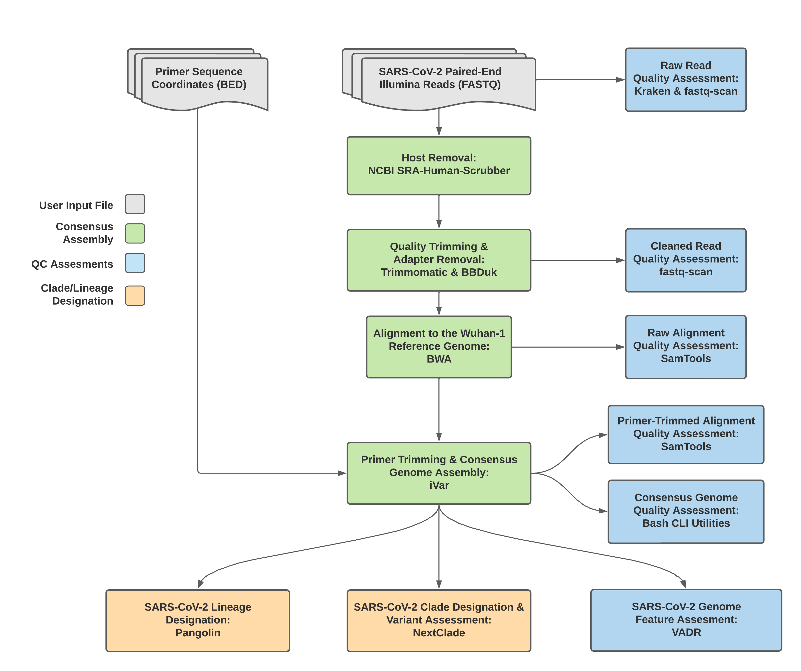
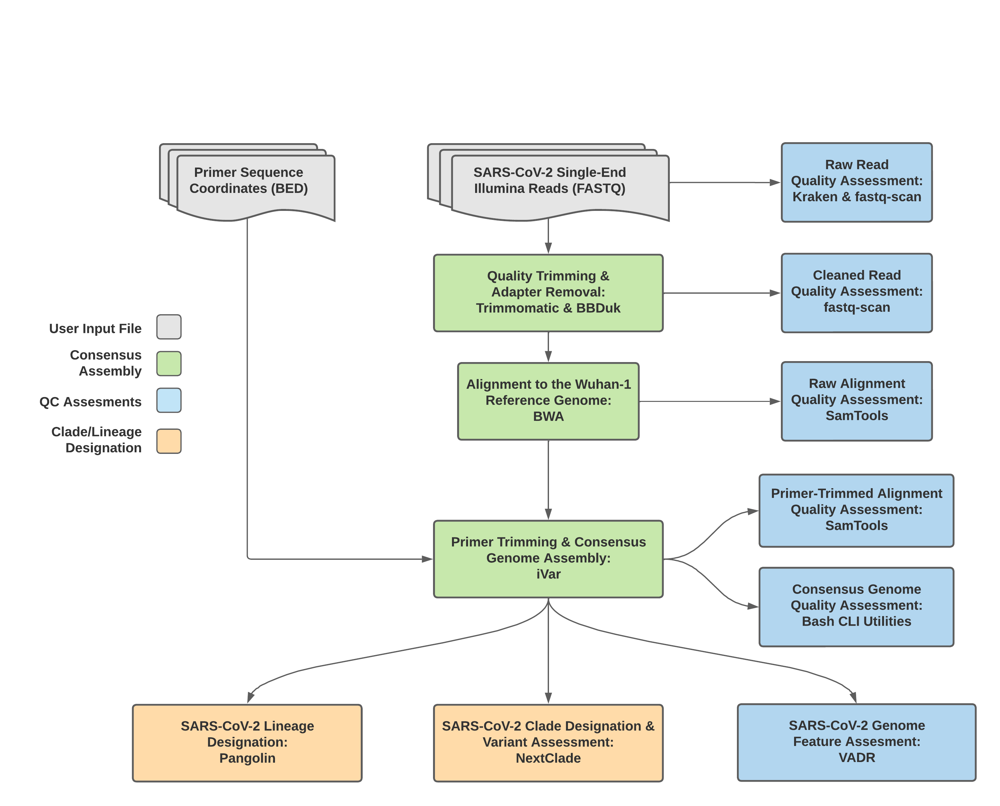
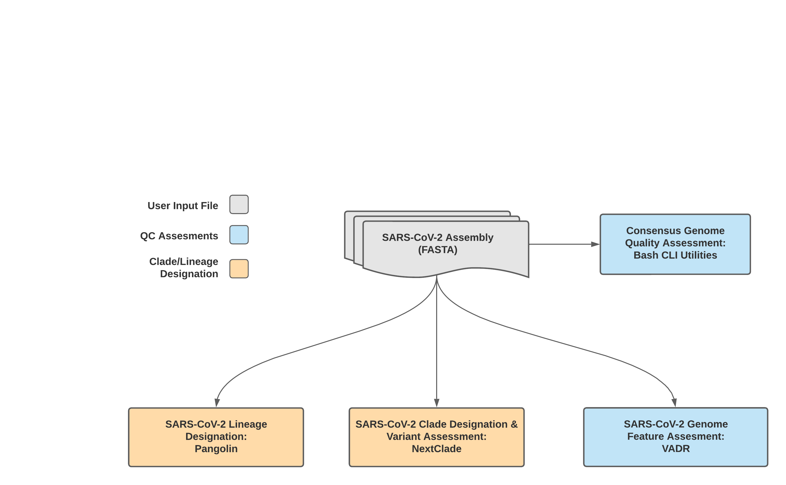

==========================
TheiaCoV Workflow Series
==========================

The TheiaCoV Workflow Series is a collection of WDL workflows for performing genomic characterization and genomic epidemiology from SARS-CoV-2 data to support public health decision-making.

TheiaCoV Workflows for Genomic Characterization
--------------------------------------------------
Genomic characterization of pathogens is an increasing priority for public health laboratories globally. The workflows in the TheiaCoV Genomic Characterization Series make this easy for SARS-CoV-2 by either taking in raw next-generation sequencing (NGS) data or FASTA assembly files to characterize the virus to the most up-to-date international standards. The workflows facilitate (as required):

1. **Assembly:** Mapping input read data to a reference genome, removing primer reads from that alignment, and then calling the consensus assembly based on the primer-trimmed alignment
2. **Quality control (QC):** Producing relevant quality-control (QC) metrics for the input read data and the generated assembly. 
3. **Characterization:** Using Pangolin for lineage assignment, NextClade for clade assignment, and VADR for validation and annotation. 

There are five workflows in the TheiaCoV Workflow Series. They all take in sequencing data generated using tiled PCR-amplicons designed for the SARS-CoV-2 genome. Most commonly, these are generated with the `Artic V3 protocol <https://github.com/artic-network/artic-ncov2019/tree/master/primer_schemes/nCoV-2019/V3>`_ but reads resulting from alternative primer/PCR schemes such as the `QIAseq Primer Panel <https://www.qiagen.com/us/products/next-generation-sequencing/rna-sequencing/qiaseq-sars-cov-2-primer-panel/>`_, the `Artic V4 Amplicon Sequencing Panel <https://github.com/artic-network/artic-ncov2019/tree/master/primer_schemes/nCoV-2019/V4>`_, the `Artic V4.1 Amplicon Sequencing Primer Panel <https://github.com/artic-network/artic-ncov2019/tree/master/primer_schemes/nCoV-2019/V4.1>`_, and the `Midnight Amplicon Primer Set <https://www.protocols.io/view/sars-cov2-genome-sequencing-protocol-1200bp-amplic-rm7vz8q64vx1/v6>`_ can also be analysed with this workflow. The primer sequence coordinates of the PCR scheme used must be provided in `BED file format <https://en.wikipedia.org/wiki/BED_(file_format)#>`_ along with the raw paired-end Illumina read data in FASTQ format. If you are running your workflow on Terra, the bed files for these most commonly used PCR primers can be found in the Data tab, in the workspace data group. The TheiaCoV workflows vary according to their input sequencing datatypes, supporting the following: 

* Illumina paired-end data (TheiaCoV_Illumina_PE_ workflow)
* Illumina single-end data (TheiaCoV_Illumina_SE_ workflow)
* Clear Labs data (TheiaCoV_ClearLabs_ workflow)
* Oxford Nanopore Technology data (TheiaCoV_ONT_ workflow)
* Previously assembled genomes in FASTA format (TheiaCoV_FASTA_ workflow)- this produces only assembly QC metrics, Pangolin lineage and clade assignments.

.. note::
   The input datatypes affect how the downstream assembly and QC steps have to be performed. Methological details for these steps are described for each workflow below. Ultimately, all workflows create equivalent assemblies, which should be assessed relative to QC guidelines for SARS-CoV-2 `(e.g. those produced by PH4GE) <https://github.com/pha4ge/pipeline-resources/blob/udubs-qc-guidance-dev/docs/qc-solutions.md#gisaid-assembly-acceptance-criteria>`_ to determine high quality data for further analysis. Characterization is undertaken in the same way in all workflows:

   **TheiaCoV Workflow series Characterization step:** All workflows in this series characterize genomes using `Pangolin <https://cov-lineages.org/>`_ for lineage assignment, `NextClade <https://docs.nextstrain.org/projects/nextclade/en/stable/index.html>`_ for clade assignment, and `VADR <https://github.com/ncbi/vadr>`_ for validation and annotation. These tools and their underlying databases are updated regularly and have many versions available, one of which should be selected when running the workflow. The latest versions are described `here <https://www.notion.so/theiagen/Docker-Image-and-Reference-Materials-for-SARS-CoV-2-Genomic-Characterization-98328c61f5cb4f77975f512b55d09108>`_.

More details on how to run these workflows through Terra are provided in the `Overview <https://public-health-viral-genomics-theiagen.readthedocs.io/en/latest/overview.html#>`_ page.

TheiaCoV_Illumina_PE 
================================

   **TheiaCoV_Illumina_PE Workflow**

**Input:** The TheiaCoV_Illumina_PE workflow was written to process Illumina paired-end (PE) read data generated by tiled PCR for genomic characterization of SARS-CoV-2. By default, this workflow will assume that input reads were generated using a 300-cycle sequencing kit (i.e. 2 x 150 bp reads). Modifications to the optional parameter for trimmomatic_minlen may be required to accommodate shorter read data, such as 2 x 75bp reads generated using a 150-cycle sequencing kit.

**Assembly:** As outlined in the schematic above, consensus genome assembly with the TheiaCoV_Illumina_PE workflow is performed by first removing human read data with the `NCBI SRA-Human-Scrubber <https://github.com/ncbi/sra-human-scrubber>`_ tool then trimming low-quality reads with `Trimmomatic <http://www.usadellab.org/cms/?page=trimmomatic>`_ and removing adapter sequences with `BBDuk <https://jgi.doe.gov/data-and-tools/software-tools/bbtools/bb-tools-user-guide/bbduk-guide/>`_. These cleaned read data are then aligned to the Wuhan-1 reference genome with `BWA <http://bio-bwa.sourceforge.net/>`_ to generate a Binary Alignment Mapping (`BAM <https://en.wikipedia.org/wiki/Binary_Alignment_Map>`_) file. Primer sequences are next removed from the BAM file using the `iVar Trim <https://andersen-lab.github.io/ivar/html/manualpage.html>`_ sub-command. The iVar Consensus sub-command is then used to generate a consensus assembly in FASTA format.

**QC:** The output files from this workflow are all subjected to quality assessment: 

* Read data is assessed with `Kraken2 <https://ccb.jhu.edu/software/kraken2/>`_ to identify the species represented by the reads and with `FastQC <https://www.bioinformatics.babraham.ac.uk/projects/fastqc/>`_ to determine read technical quality. 
* Quality metrics about the genome alignment are generated with `Samtools <http://www.htslib.org/>`_
* Bash CLI utilities generate quality metrics about the consensus genome assembly. 
* NCBI’S VADR tool screens for potentially errant features in the assembly (e.g. erroneous frame-shift mutations).

More information about the TheiaCoV_Illumina_PE workflow including inputs, outputs and default tool parameters can be found in the tables of `required user inputs <https://github.com/theiagen/public_health_viral_genomics/blob/main/docs/source/tables/theiacov_workflows/theiacov_illumina_pe_required_inputs.csv>`_, `optional user inputs <https://github.com/theiagen/public_health_viral_genomics/blob/main/docs/source/tables/theiacov_workflows/theiacov_illumina_pe_optional_inputs.csv>`_ and the `outputs <https://github.com/theiagen/public_health_viral_genomics/blob/main/docs/source/tables/theiacov_workflows/theiacov_illumina_pe_outputs.csv>`_ .

|

TheiaCoV_Illumina_SE
=================

   **TheiaCoV_Illumina_SE Data Workflow**

The TheiaCoV_Illumina_SE workflow was written to process Illumina single-end (SE) read data. Input reads are assumed to be the product of sequencing tiled PCR-amplicons designed for the SARS-CoV-2 genome.

.. note::
  By default, this workflow will assume that input reads were generated using a 35-cycle kit (i.e. 1 x 35 bp reads). Modifications to the optional parameter for trimmomatic_minlen may be required to accommodate for longer read data.

Upon initiating a TheiaCoV_Illumina_SE job, the input primer scheme coordinates and raw paired-end Illumina read data provided for each sample will be processed to perform consensus genome assembly, infer the quality of both raw read data and the generated consensus genome, and assign SARS-CoV-2 lineage and clade types as outlined in the TheiaCoV_Illumina_PE data workflow below.

Consensus genome assembly with the TheiaCoV_Illumina_SE workflow is performed by first trimming low-quality reads with Trimmomatic and removing adapter sequences with BBDuk.  These cleaned read data are then aligned to the Wuhan-1 reference genome with BWA to generate a Binary Alignment Mapping (BAM) file. Primer sequences are then removed from the BAM file using the iVar Trim sub-command. The iVar consensus sub-command is then  utilized to generate a consensus assembly in FASTA format. This assembly is then used to assign lineage and clade designations with Pangolin and NextClade. NCBI’S VADR tool is also employed to screen for potentially errant features (e.g. erroneous frame-shift mutations) in the consensus assembly.

More information on requirements user inputs, optional user inputs, default tool parameters and the outputs generated by TheiaCoV_Illumina_SE are outlined below.

Required User Inputs
********************
Download CSV: :download:`TheiaCoV_Illumina_SE_required_inputs.csv <tables/theiacov_workflows/theiacov_illumina_se_required_inputs.csv>`

.. csv-table::
   :file: tables/theiacov_workflows/theiacov_illumina_se_required_inputs.csv
   :widths: 20, 20, 20, 40
   :header-rows: 1

|

Optional User Inputs
********************

Download CSV: :download:`TheiaCoV_Illumina_SE_optional_inputs.csv <tables/theiacov_workflows/theiacov_illumina_se_optional_inputs.csv>`

.. csv-table::
  :file: tables/theiacov_workflows/theiacov_illumina_se_optional_inputs.csv
  :widths: 10, 10, 10, 10, 20
  :header-rows: 1

|

Outputs
********************
Download CSV: :download:`TheiaCoV_Illumina_SE_default_outputs.csv <tables/theiacov_workflows/theiacov_illumina_se_outputs.csv>`

.. csv-table::
   :file: tables/theiacov_workflows/theiacov_illumina_se_outputs.csv
   :widths: 20, 20, 60
   :header-rows: 1

|

TheiaCoV_ClearLabs
=================
The TheiaCoV_ClearLabs workflow was written to process ClearLabs WGS read data for SARS-CoV-2 amplicon sequencing. Currently, Clear Labs sequencing is performed with the Artic V3 protocol. If alternative primer schemes such as the Qiaseq Primer Panel, the Swift Amplicon SARS-CoV-2 Panel and the Artic V4 Amplicon Sequencing Panel become avaialble on the platform, these data can can also be analysed with this workflow since the primer sequence coordinates of the PCR scheme utilized must be provided along with the raw Clear Labs read data must be provided in BED and FASTQ file formats, respectively.

Upon initiating a TheiaCoV_ClearLabs run,  input ClearLabs read data provided for each sample will be processed to perform consensus genome assembly, infer the quality of both raw read data and the generated consensus genome, and assign SARS-CoV-2 lineage and clade types as outlined in the TheiaCoV_ClearLabs data workflow below.

.. figure:: images/TheiaCoV_ClearLabs.png
   :width: 800
   :alt: TheiaCoV_ClearLabs workflow
   :figclass: align-center

   **TheiaCoV_ClearLabs Data Workflow**

Consensus genome assembly with the TheiaCoV_ClearLabs workflow is performed by first de-hosting read data with the NCBI SRA-Human-Scrubber tool then following the `Artic nCoV-2019 novel coronavirs bioinformatics protocol <https://artic.network/ncov-2019/ncov2019-bioinformatics-sop.html>`. Briefly, input reads are aligned to the Wuhan-1 reference genome with minimap2 to generate a Binary Alignment Mapping (BAM) file. Primer sequences are then removed from the BAM file and a consensus assembly file is generated using the Artic medaka command. This assembly is then used to assign lineage and clade designations with Pangolin and NextClade. NCBI’S VADR tool is also employed to screen for potentially errant features (e.g. erroneous frame-shift mutations) in the consensus assembly.

.. note::
  Read-trimming is performed on raw read data generated on the ClearLabs instrument and thus not a required step in the TheiaCoV_ClearLabs workflow.

More information on required user inputs, optional user inputs, default tool parameters and the outputs generated by TheiaCoV_CLearLabs are outlined below.

Required User Inputs
********************
Download CSV: :download:`TheiaCoV_ClearLabs_required_inputs.csv <tables/theiacov_workflows/theiacov_clearlabs_required_inputs.csv>`

.. csv-table::
   :file: tables/theiacov_workflows/theiacov_clearlabs_required_inputs.csv
   :widths: 20, 20, 20, 40
   :header-rows: 1

|

Optional User Inputs
********************

Download CSV: :download:`TheiaCoV_ClearLabs_optional_inputs.csv <tables/theiacov_workflows/theiacov_clearlabs_optional_inputs.csv>`

.. csv-table::
  :file: tables/theiacov_workflows/theiacov_clearlabs_optional_inputs.csv
  :widths: 10, 10, 10, 10, 20
  :header-rows: 1

|

Outputs
********************
Download CSV: :download:`TheiaCoV_ClearLabs_default_outputs.csv <tables/theiacov_workflows/theiacov_clearlabs_outputs.csv>`

.. csv-table::
   :file: tables/theiacov_workflows/theiacov_clearlabs_outputs.csv
   :widths: 20, 20, 60
   :header-rows: 1

|

TheiaCoV_ONT
=========
The TheiaCoV_ONT workflow was written to process basecalled and demultiplexed Oxford Nanopore Technology (ONT) read data. The most common read data analyzed by the TheiaCoV_ONT workflow are generated with the Artic V3 protocol. Alternative primer schemes such as the Qiaseq Primer Panel, the Swift Amplicon SARS-CoV-2 Panel and the Artic V4 Amplicon Sequencing Panel however, can also be analysed with this workflow since the primer sequence coordinates of the PCR scheme utilized must be provided along with the raw paired-end Illumina read data in BED and FASTQ file formats, respectively.

Upon initiating a TheiaCoV_ONT run,  input ONT read data provided for each sample will be processed to perform consensus genome assembly, infer the quality of both raw read data and the generated consensus genome, and assign SARS-CoV-2 lineage and clade types as outlined in the TheiaCoV_ONT data workflow below.

.. figure:: images/TheiaCoV_ONT.png
   :width: 800
   :alt: TheiaCoV_ONT workflow
   :figclass: align-center

   **TheiaCoV_ONT Data Workflow**

Consensus genome assembly with the TheiaCoV_ONT workflow is performed performed by first de-hosting read data with the NCBI SRA-Human-Scrubber tool then following then following  `Artic nCoV-2019 novel coronavirs bioinformatics protocol <https://artic.network/ncov-2019/ncov2019-bioinformatics-sop.html>`. Briefly, input reads are filtered by size (min-length: 400bp; max-length: 700bp) with the Aritc guppyplex command.  These size-selected read data are aligned to the Wuhan-1 reference genome with minimap2 to generate a Binary Alignment Mapping (BAM) file. Primer sequences are then removed from the BAM file and a consensus assembly file is generated using the Artic medaka command. This assembly is then used to assign lineage and clade designations with Pangolin and NextClade. NCBI’S VADR tool is also employed to screen for potentially errant features (e.g. erroneous frame-shift mutations) in the consensus assembly.

More information on required user inputs, optional user inputs, default tool parameters and the outputs generated by TheiaCoV_ONT are outlined below.

Required User Inputs
********************
Download CSV: :download:`TheiaCoV_ONT_required_inputs.csv <tables/theiacov_workflows/theiacov_ont_required_inputs.csv>`

.. csv-table::
   :file: tables/theiacov_workflows/theiacov_ont_required_inputs.csv
   :widths: 20, 20, 20, 40
   :header-rows: 1

|

Optional User Inputs
********************

Download CSV: :download:`TheiaCoV_ONT_optional_inputs.csv <tables/theiacov_workflows/theiacov_ont_optional_inputs.csv>`

.. csv-table::
  :file: tables/theiacov_workflows/theiacov_ont_optional_inputs.csv
  :widths: 10, 10, 10, 10, 20
  :header-rows: 1

|

Outputs
********************
Download CSV: :download:`TheiaCoV_ONT_default_outputs.csv <tables/theiacov_workflows/theiacov_ont_outputs.csv>`

.. csv-table::
   :file: tables/theiacov_workflows/theiacov_ont_outputs.csv
   :widths: 20, 20, 60
   :header-rows: 1

|

TheiaCoV_FASTA
===========
The TheiaCoV_FASTA workflow was written to process SARS-CoV-2 assembly files to infer the quality of the input assembly and assign SARS-CoV-2 lineage and clade types as outlined in the TheiaCoV_FASTA data workflow below.

   **TheiaCoV_FASTA Data Workflow**

The quality of input SARS-CoV-2 genome assemblies are assessed by the TheiaCoV_FASTA workflow using a series of bash shell scripts. Input assemblies are then used to assign lineage and clade designations with Pangolin and NextClade. NCBI’S VADR tool is also employed to screen for potentially errant features (e.g. erroneous frame-shift mutations) in the consensus assembly.

More information on required user inputs, optional user inputs, default tool parameters and the outputs generated by TheiaCoV_FASTA are outlined below.

Required User Inputs
********************
Download CSV: :download:`TheiaCoV_FASTA_required_inputs.csv <tables/theiacov_workflows/theiacov_fasta_required_inputs.csv>`

.. csv-table::
   :file: tables/theiacov_workflows/theiacov_fasta_required_inputs.csv
   :widths: 20, 20, 20, 40
   :header-rows: 1

|

Optional User Inputs
********************

Download CSV: :download:`TheiaCoV_FASTA_optional_inputs.csv <tables/theiacov_workflows/theiacov_fasta_optional_inputs.csv>`

.. csv-table::
  :file: tables/theiacov_workflows/theiacov_fasta_optional_inputs.csv
  :widths: 10, 10, 10, 10, 20
  :header-rows: 1

|

Outputs
********************
Download CSV: :download:`TheiaCoV_FASTA_default_outputs.csv <tables/theiacov_workflows/theiacov_fasta_outputs.csv>`

.. csv-table::
   :file: tables/theiacov_workflows/theiacov_fasta_outputs.csv
   :widths: 20, 20, 60
   :header-rows: 1

|

TheiaCoV Workflows for Genomic Epidemiology
----------------------------------------

Genomic Epidemiology, i.e. generating phylogenetic trees from a set of consensus assemblies (FASTA format) to track the spread and evolution of viruses on a local, national or global scale, has been an important methodological approach in the effort to mitigate disease transmission.

The TheiaCoV Genomic Epidemiology Series contains two seperate WDL workflows (TheiaCoV_Augur_Prep and TheiaCoV_Augur_Run) that process a set of viral genomic assemblies to generate phylogenetic trees (JSON format) and metadata files which can be used to assign epidemiological data to each assembly for subsequent analyses.

The two TheiaCoV workflows for genomic epidemiology must be run sequentially to first prepare the data for phylogenetic analysis and second to generate the phylogenetic trees. More information on the technical details of these processes and information on how to utilize and apply these workflows for public health investigations is available below.

Required User Inputs
********************
Download CSV: :download:`TheiaCoV_Augur_Prep_required_inputs.csv <tables/theiacov_workflows/theiacov_augur_prep_required_inputs.csv>`

.. csv-table::
   :file: tables/theiacov_workflows/theiacov_augur_prep_required_inputs.csv
   :widths: 20, 20, 20, 40
   :header-rows: 1
|

TheiaCoV_Augur_Prep
================
The TheiaCoV_Augur_Prep workflow was written to process consensus assemblies (FASTA format) and the associated metadata in preparation for running the TheiaCoV_Augur_Run. Input assemblies should be of similar quality (percent reference coverage, number of ambiguous bases, etc.). Inputs with highly discordant quality metrics may result in inaccurate inference of genetic relatedness.

.. note::
  There must be some sequence diversity in the input set of assemblies to be analyzed. As a rule of thumb, the smaller the input set, the more sequence diversity will be required to make any sort of genomic inference. If a small (~10) set of viral genomic assemblies is used as the input then it may be necessary to add one significantly divergent assembly.

Upon initiating a TheiaCoV_Augur_Prep run, input assembly/consensus files and associated metadata will be used to produce the array of assembly/consensus files and the array of metadata files to be used as inputs for the TheiaCoV_Augur_Run workflow.

Metadata files are prepared with the Augur_Prep workflow by using BASH commands to first de-identify, and then to parse the headers of the input assembly files.

Required User Inputs
********************
Download CSV: :download:`TheiaCoV_Augur_Prep_required_inputs.csv <tables/theiacov_workflows/theiacov_augur_prep_required_inputs.csv>`

.. csv-table::
   :file: tables/theiacov_workflows/theiacov_augur_prep_required_inputs.csv
   :widths: 20, 20, 20, 40
   :header-rows: 1
|

TheiaCoV_Augur_Run
===============
The TheiaCoV_Augur_Run workflow was written to process an array of assembly/consensus files (FASTA format) and and array of sample metadata files (TSV format) using a modified version of The Broad Institute's sarscov2_nextstrain WDL workflow to create an Auspice JSON file; output from the modified sarscov2_nextstrain workflow will also be used to infer SNP distances and create a static PDF report.

Upon initiating a TheiaCoV_Augur_Run run, the input assembly/consensus file array and the associated metadata file array will be used to generate a JSON file that is compatible with phylogenetic tree building software. This JSON can then be used in Auspice or Nextstrain to view the phylogenetic tree. This phylogeneic tree can be used in genomic epidemiological analysis to visualize the genetic relatedness of a set of samples. The associated metadata can then be used to add context to the phylogenetic visualization.

Required User Inputs
********************
Download CSV: :download:`TheiaCoV_Augur_Run_required_inputs.csv <tables/theiacov_workflows/theiacov_augur_prep_required_inputs.csv>`

.. csv-table::
   :file: tables/theiacov_workflows/theiacov_augur_run_required_inputs.csv
   :widths: 20, 20, 20, 40
   :header-rows: 1

|
