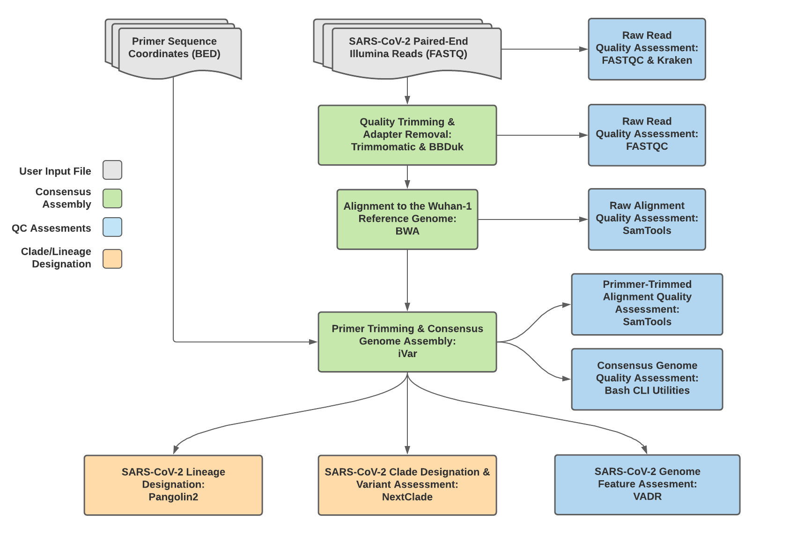
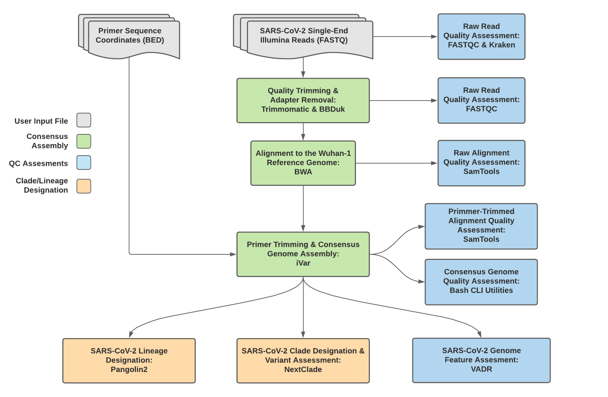
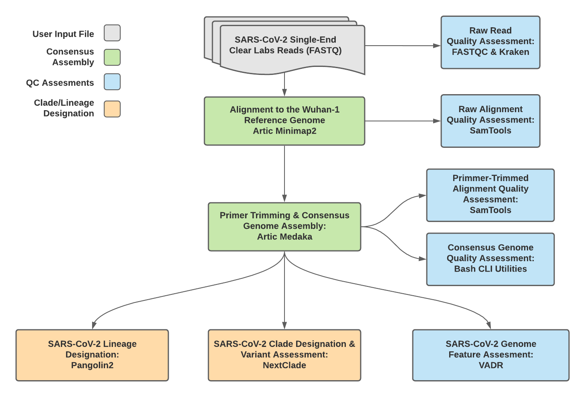
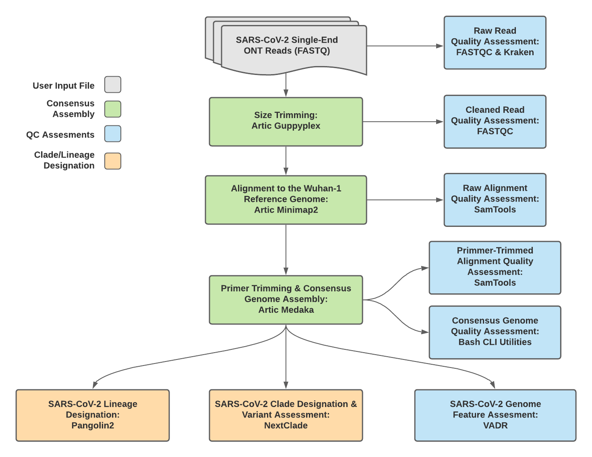

======================
Titan Workflow Series
======================

The Titan Workflow Series is a collection of WDL workflows developed for performing genomic characterization and genomic epidemiology of viral samples to support public health decision-making. As of today (October 14th, 2021) these workflows are specific to SARS-CoV-2 amplicon read data, but work is underway to allow for the analysis of other viral pathogens of concern.

Titan Workflows for Genomic Characterization
--------------------------------------------
Genomic characterization, *i.e.* generating consensus assemblies (FASTA format) from next-generation sequencing (NGS) read data (FASTQ format) to assign samples with relevant nomenclature designation (e.g. PANGO lineage and NextClade clades) is an increasingly critical function to public health laboratories around the world.

The Titan Genomic Characterization Series includes four separate WDL workflows (Titan_Illumina_PE, Titan_Illumina_SE, Titan_ClearLabs, and Titan_ONT) that process NGS read data from four different sequencing approaches: Illumina paired-end, Illumina single-end, Clear Labs, and Oxford Nanopore Technology (ONT)) to generate consensus assemblies, produce relevant quality-control metrics for both the input read data and the generated assembly, and assign samples with a lineage and clade designation using Pangolin and NextClade, respectively. 

All four Titan workflows for genomic characterization will generate a viral assembly by mapping input read data to a reference genome, removing primer reads from that alignment, and then calling the consensus assembly based on the primer-trimmed alignment. These consensus assemblies are then fed into the Pangolin and NextClade CLI tools for lineage and clade assignments.

The major difference between each of these Titan Genomic Characterization workflows is in how the read mapping, primer trimming, and consensus genome calling is performed. More information on the technical details of these processes and information on how to utilize and apply these workflows for public health investigations is available below.

A fifth WDL workflow, Titan_FASTA, was added to take in assembled SC2 genomes, perform basic QC (e.g. number of Ns), and assign samples with a lineage and clade designation using Pangolin and NextClade, respectively.

A series of introductory training videos that provide conceptual overviews of methodologies and walkthrough tutorials on how to utilize these Titan workflows through Terra are available on the Theiagen Genomics YouTube page:

.. raw:: html

   <iframe width="560" height="315" src="https://www.youtube.com/embed/zP9I1r6TNrw" title="YouTube video player" frameborder="0" allow="accelerometer; autoplay; clipboard-write; encrypted-media; gyroscope; picture-in-picture" allowfullscreen></iframe>
   

|

Titan_Illumina_PE
=================
The Titan_Illumina_PE workflow was written to process Illumina paired-end (PE) read data. Input reads are assumed to be the product of sequencing tiled PCR-amplicons designed for the SARS-CoV-2 genome. The most common read data analyzed by the Titan_Illumina_PE workflow are generated with the Artic V3 protocol. Alternative primer schemes such as the Qiaseq Primer Panel, the Swift Amplicon SARS-CoV-2 Panel and the Artic V4 Amplicon Sequencing Panel however, can also be analysed with this workflow since the primer sequence coordinates of the PCR scheme utilized must be provided along with the raw paired-end Illumina read data in BED and FASTQ file formats, respectively. 

.. note::
  By default, this workflow will assume that input reads were generated using a 300-cycle kit (i.e. 2 x 150 bp reads). Modifications to the optional parameter for trimmomatic_minlen may be required to accommodate for shorter read data, such as 2 x 75bp reads generated using a 150-cycle kit.
  
Upon initiating a Titan_Illumina_PE job, the input primer scheme coordinates and raw paired-end Illumina read data provided for each sample will be processed to perform consensus genome assembly, infer the quality of both raw read data and the generated consensus genome, and assign samples SARS-CoV-2 lineage and clade types as outlined in the Titan_Illumina_PE data workflow below.

   
   **Titan_Illumina_PE v1.4.4 Data Workflow**

Consensus genome assembly with the Titan_Illumina_PE workflow is performed by first de-hosting read data with the NCBI SRA-Human-Scrubber tool then trimming low-quality reads with Trimmomatic and removing adapter sequences with BBDuk.  These cleaned read data are then aligned to the Wuhan-1 reference genome with BWA to generate a Binary Alignment Mapping (BAM) file. Primer sequences are then removed from the BAM file using the iVar Trim sub-command. The iVar consensus sub-command is then  utilized to generate a consensus assembly in FASTA format. This assembly is then used to assign lineage and clade designations with Pangolin and NextClade. NCBI’S VADR tool is also employed to screen for potentially errant features (e.g. erroneous frame-shift mutations) in the consensus assembly.  

More information on required user inputs, optional user inputs, default tool parameters and the outputs generated by Titan_Illumina_PE are outlined below.   

Required User Inputs
********************
Download CSV: :download:`Titan_Illumina_PE_required_inputs.csv <tables/titan_workflows/titan_illumina_pe_required_inputs.csv>`

.. csv-table::
   :file: tables/titan_workflows/titan_illumina_pe_required_inputs.csv
   :widths: 20, 20, 20, 40
   :header-rows: 1
   
|

Optional User Inputs
********************

Download CSV: :download:`Titan_Illumina_PE_optional_inputs.csv <tables/titan_workflows/titan_illumina_pe_optional_inputs.csv>`

.. csv-table::
  :file: tables/titan_workflows/titan_illumina_pe_optional_inputs.csv
  :widths: 10, 10, 10, 10, 20
  :header-rows: 1
          
|

Outputs 
********************
Download CSV: :download:`Titan_Illumina_PE_default_outputs.csv <tables/titan_workflows/titan_illumina_pe_outputs.csv>`

.. csv-table::
   :file: tables/titan_workflows/titan_illumina_pe_outputs.csv
   :widths: 20, 20, 60
   :header-rows: 1
   
|

Titan_Illumina_SE
=================
The Titan_Illumina_SE workflow was written to process Illumina single-end (SE) read data. Input reads are assumed to be the product of sequencing tiled PCR-amplicons designed for the SARS-CoV-2 genome. The most common read data analyzed by the Titan_Illumina_SE workflow are generated with the Artic V3 protocol. Alternative primer schemes such as the Qiaseq Primer Panel, however, can also be analysed with this workflow since the primer sequence coordinates of the PCR scheme utilized must be provided along with the raw paired-end Illumina read data in BED and FASTQ file formats, respectively. 

.. note::
  By default, this workflow will assume that input reads were generated using a 35-cycle kit (i.e. 1 x 35 bp reads). Modifications to the optional parameter for trimmomatic_minlen may be required to accommodate for longer read data.
  
Upon initiating a Titan_Illumina_SE job, the input primer scheme coordinates and raw paired-end Illumina read data provided for each sample will be processed to perform consensus genome assembly, infer the quality of both raw read data and the generated consensus genome, and assign samples SARS-CoV-2 lineage and clade types as outlined in the Titan_Illumina_PE data workflow below.

   
   **Titan_Illumina_SE v1.4.4 Data Workflow**

Consensus genome assembly with the Titan_Illumina_SE workflow is performed by first trimming low-quality reads with Trimmomatic and removing adapter sequences with BBDuk.  These cleaned read data are then aligned to the Wuhan-1 reference genome with BWA to generate a Binary Alignment Mapping (BAM) file. Primer sequences are then removed from the BAM file using the iVar Trim sub-command. The iVar consensus sub-command is then  utilized to generate a consensus assembly in FASTA format. This assembly is then used to assign lineage and clade designations with Pangolin and NextClade. NCBI’S VADR tool is also employed to screen for potentially errant features (e.g. erroneous frame-shift mutations) in the consensus assembly.  

More information on required user inputs, optional user inputs, default tool parameters and the outputs generated by Titan_Illumina_SE are outlined below.   

Required User Inputs
********************
Download CSV: :download:`Titan_Illumina_SE_required_inputs.csv <tables/titan_workflows/titan_illumina_se_required_inputs.csv>`

.. csv-table::
   :file: tables/titan_workflows/titan_illumina_se_required_inputs.csv
   :widths: 20, 20, 20, 40
   :header-rows: 1
   
|

Optional User Inputs
********************

Download CSV: :download:`Titan_Illumina_SE_optional_inputs.csv <tables/titan_workflows/titan_illumina_se_optional_inputs.csv>`

.. csv-table::
  :file: tables/titan_workflows/titan_illumina_se_optional_inputs.csv
  :widths: 10, 10, 10, 10, 20
  :header-rows: 1
          
|

Outputs 
********************
Download CSV: :download:`Titan_Illumina_SE_default_outputs.csv <tables/titan_workflows/titan_illumina_se_outputs.csv>`

.. csv-table::
   :file: tables/titan_workflows/titan_illumina_se_outputs.csv
   :widths: 20, 20, 60
   :header-rows: 1
   
|

Titan_ClearLabs
=================
The Titan_ClearLabs workflow was written to process ClearLabs WGS read data for SARS-CoV-2 amplicon sequencing. Currently, Clear Labs sequencing is performed with the Artic V3 protocol. If alternative primer schemes such as the Qiaseq Primer Panel, the Swift Amplicon SARS-CoV-2 Panel and the Artic V4 Amplicon Sequencing Panel become avaialble on the platform, these data can can also be analysed with this workflow since the primer sequence coordinates of the PCR scheme utilized must be provided along with the raw Clear Labs read data must be provided in BED and FASTQ file formats, respectively. 

Upon initiating a Titan_ClearLabs run,  input ClearLabs read data provided for each sample will be processed to perform consensus genome assembly, infer the quality of both raw read data and the generated consensus genome, and assign samples SARS-CoV-2 lineage and clade types as outlined in the Titan_ClearLabs data workflow below.

   
   **Titan_ClearLabs v1.4.4 Data Workflow**

Consensus genome assembly with the Titan_ClearLabs workflow is performed by first de-hosting read data with the NCBI SRA-Human-Scrubber tool then following the `Artic nCoV-2019 novel coronavirs bioinformatics protocol <https://artic.network/ncov-2019/ncov2019-bioinformatics-sop.html>`. Briefly, input reads are aligned to the Wuhan-1 reference genome with minimap2 to generate a Binary Alignment Mapping (BAM) file. Primer sequences are then removed from the BAM file and a consensus assembly file is generated using the Artic medaka command. This assembly is then used to assign lineage and clade designations with Pangolin and NextClade. NCBI’S VADR tool is also employed to screen for potentially errant features (e.g. erroneous frame-shift mutations) in the consensus assembly.  

.. note::
  Read-trimming is performed on raw read data generated on the ClearLabs instrument and thus not a required step in the Titan_ClearLabs workflow.
  

More information on required user inputs, optional user inputs, default tool parameters and the outputs generated by Titan_CLearLabs are outlined below.   

Required User Inputs
********************
Download CSV: :download:`Titan_ClearLabs_required_inputs.csv <tables/titan_workflows/titan_clearlabs_required_inputs.csv>`

.. csv-table::
   :file: tables/titan_workflows/titan_clearlabs_required_inputs.csv
   :widths: 20, 20, 20, 40
   :header-rows: 1
   
|

Optional User Inputs
********************

Download CSV: :download:`Titan_ClearLabs_optional_inputs.csv <tables/titan_workflows/titan_clearlabs_optional_inputs.csv>`

.. csv-table::
  :file: tables/titan_workflows/titan_clearlabs_optional_inputs.csv
  :widths: 10, 10, 10, 10, 20
  :header-rows: 1
          
|

Outputs 
********************
Download CSV: :download:`Titan_ClearLabs_default_outputs.csv <tables/titan_workflows/titan_clearlabs_outputs.csv>`

.. csv-table::
   :file: tables/titan_workflows/titan_clearlabs_outputs.csv
   :widths: 20, 20, 60
   :header-rows: 1
   
|

Titan_ONT
=========
The Titan_ONT workflow was written to process basecalled and demultiplexed Oxford Nanopore Technology (ONT) read data. The most common read data analyzed by the Titan_ONT workflow are generated with the Artic V3 protocol. Alternative primer schemes such as the Qiaseq Primer Panel, the Swift Amplicon SARS-CoV-2 Panel and the Artic V4 Amplicon Sequencing Panel however, can also be analysed with this workflow since the primer sequence coordinates of the PCR scheme utilized must be provided along with the raw paired-end Illumina read data in BED and FASTQ file formats, respectively. 

.. note::
  As of May 2021, alternative primer schemes are not currently supported for the Titan_ONT workflow, but active development us underway to allow for such analysis in the near future.
  
Upon initiating a Titan_ONT run,  input ONT read data provided for each sample will be processed to perform consensus genome assembly, infer the quality of both raw read data and the generated consensus genome, and assign samples SARS-CoV-2 lineage and clade types as outlined in the Titan_ONT data workflow below.

   
   **Titan_ONT v1.4.4 Data Workflow**

Consensus genome assembly with the Titan_ONT workflow is performed performed by first de-hosting read data with the NCBI SRA-Human-Scrubber tool then following then following  `Artic nCoV-2019 novel coronavirs bioinformatics protocol <https://artic.network/ncov-2019/ncov2019-bioinformatics-sop.html>`. Briefly, input reads are filtered by size (min-length: 400bp; max-length: 700bp) with the Aritc guppyplex command.  These size-selected read data are aligned to the Wuhan-1 reference genome with minimap2 to generate a Binary Alignment Mapping (BAM) file. Primer sequences are then removed from the BAM file and a consensus assembly file is generated using the Artic medaka command. This assembly is then used to assign lineage and clade designations with Pangolin and NextClade. NCBI’S VADR tool is also employed to screen for potentially errant features (e.g. erroneous frame-shift mutations) in the consensus assembly.  

More information on required user inputs, optional user inputs, default tool parameters and the outputs generated by Titan_ONT are outlined below.   

Required User Inputs
********************
Download CSV: :download:`Titan_ONT_required_inputs.csv <tables/titan_workflows/titan_ont_required_inputs.csv>`

.. csv-table::
   :file: tables/titan_workflows/titan_ont_required_inputs.csv
   :widths: 20, 20, 20, 40
   :header-rows: 1
   
|

Optional User Inputs
********************

Download CSV: :download:`Titan_ONT_optional_inputs.csv <tables/titan_workflows/titan_ont_optional_inputs.csv>`

.. csv-table::
  :file: tables/titan_workflows/titan_ont_optional_inputs.csv
  :widths: 10, 10, 10, 10, 20
  :header-rows: 1
          
|

Outputs 
********************
Download CSV: :download:`Titan_ONT_default_outputs.csv <tables/titan_workflows/titan_ont_outputs.csv>`

.. csv-table::
   :file: tables/titan_workflows/titan_ont_outputs.csv
   :widths: 20, 20, 60
   :header-rows: 1
   
|

Titan Workflows for Genomic Epidemiology
--------------------------------------------

Genomic Epidemiology, i.e. generating phylogenetic trees from a set of consensus assemblies (FASTA format) to track the spread and evolution of viruses on a local, national or global scale, has been an important methodological approach in the effort to mitigate disease transmission.

The Titan Genomic Epidemiology Series contains two seperate WDL workflows (Titan_Augur_Prep and Titan_Augur_Run) that process a set of viral genomic assemblies to generate phylogenetic trees (JSON format) and metadata files which can be used to assign epidemiological data to each assembly for subsequent analyses.

The two Titan workflows for genomic epidemiology must be run sequentially to first prepare the data for phylogenetic analysis and second to generate the phylogenetic trees. More information on the technical details of these processes and information on how to utilize and apply these workflows for public health investigations is available below.

Required User Inputs
********************
Download CSV: :download:`Titan_Augur_Prep_required_inputs.csv <tables/titan_workflows/titan_augur_prep_required_inputs.csv>`

.. csv-table::
   :file: tables/titan_workflows/titan_augur_prep_required_inputs.csv
   :widths: 20, 20, 20, 40
   :header-rows: 1
|

Titan_Augur_Prep
================
The Titan_Augur_Prep workflow was written to process consensus assemblies (FASTA format) and the associated metadata in preparation for running the Titan_Augur_Run. Input assemblies should be of similar quality (percent reference coverage, number of ambiguous bases, etc.). Inputs with highly discordant quality metrics may result in innacurate inference of genetic relatedness.

.. note::
  There must be some sequence diversity in the input set of assemblies to be analyzed. As a rule of thumb, the smaller the input set, the more sequence diversity will be required to make any sort of genomic inference. If a small (~10) set of viral genomic assemblies is used as the input then it may be necessary to add one significantly divergent assembly.
  
Upon initiating a Titan_Augur_Prep run, input assembly/consensus files and associated metadata will be used to produce the array of assembly/consensus files and the array of metadata files to be used as inputs for the Titan_Augur_Run workflow.

Metadata files are prepared with the Auger_Prep workflow by using BASH commands to first de-identify, and then to parse the headers of the input assembly files. 

|

Titan_Augur_Run
===============
The Titan_Augur_Run workflow was written to process an array of assembly/consensus files (FASTA format) and and array of sample metadata files (TSV format) using a modified version of The Broad Institute's sarscov2_nextstrain WDL workflow to create an Auspice JSON file; output from the modified sarscov2_nextstrain workflow will also be used to infer SNP distances and create a static PDF report.

Upon initiating a Titan_Augur_Run run, the input assembly/consensus file array and the associated metadata file array will be used to generate a JSON file that is compatible with phylogenetic tree building software. This JSON can then be used in Auspice or Nextstrain to view the phylogenetic tree. This phylogeneic tree can be used in genomic epidemiological analysis to visualize the genetic relatedness of a set of samples. The associated metadata can then be used to add context to the phylogenetic visualization.

Required User Inputs
********************
Download CSV: :download:`Titan_Augur_Run_required_inputs.csv <tables/titan_workflows/titan_augur_prep_required_inputs.csv>`

.. csv-table::
   :file: tables/titan_workflows/titan_augur_run_required_inputs.csv
   :widths: 20, 20, 20, 40
   :header-rows: 1

|
